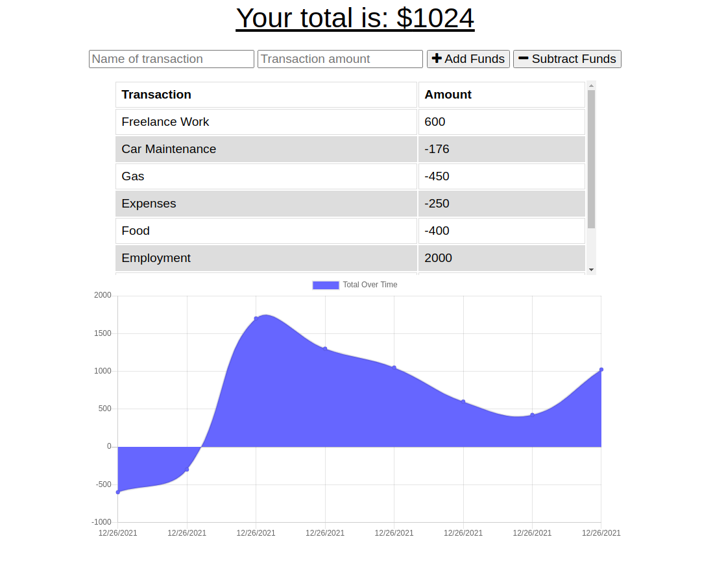

# amy-budget-tracker

## Description
This aplication is a budget tracker that allows users to add expenses and deposits so they can keep track of their funds. This app is a Progressive Web Application which allows the users to use the app while not connected to internet or if they are on a slow connection without losing their functionality. If the user enters transactions offline, the total should be updated when they're brought back online

## User Story
* AS AN avid traveler
* I WANT to be able to track my withdrawals and deposits with or without a data/internet connection
* SO THAT my account balance is accurate when I am traveling 

## Acceptance Criteria
GIVEN a budget tracker without an internet connection 
WHEN the user inputs an expense or deposit 
THEN they will receive a notification that they have added an expense or deposit 
WHEN the user reestablishes an internet connection 
THEN the deposits or expenses added while they were offline are added to their transaction history and their totals are updated 

## Installation
The application require the use of InedexDB, MongoDB Atlas, Manifest.json and Service worker for running it.

InedexDB to keep track of database while offline
MongoDB Atlas to allow for deployment to Heroku and connection to database from the cloud
Manifest.json to make a Progressive Web Application
Service worker to keep track of cache files while offline

## Screenshots
Budget Tracker
 

## Github Page: 
https://github.com/amykep/amy-budget-tracker

## Deployed on Heroku at:
 https://vast-everglades-41705.herokuapp.com/